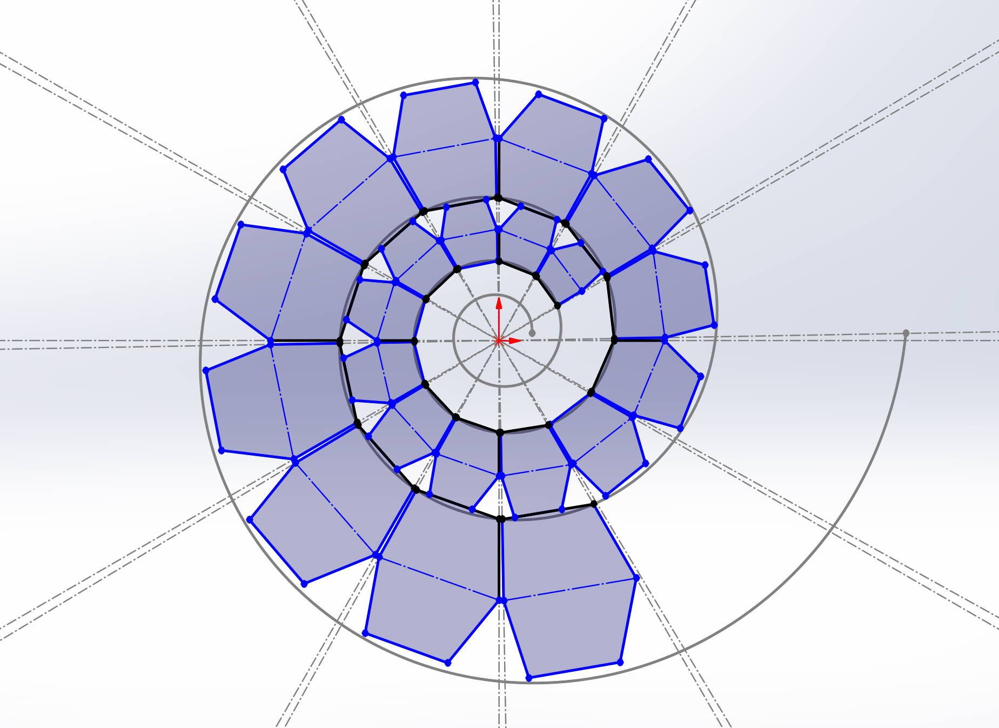
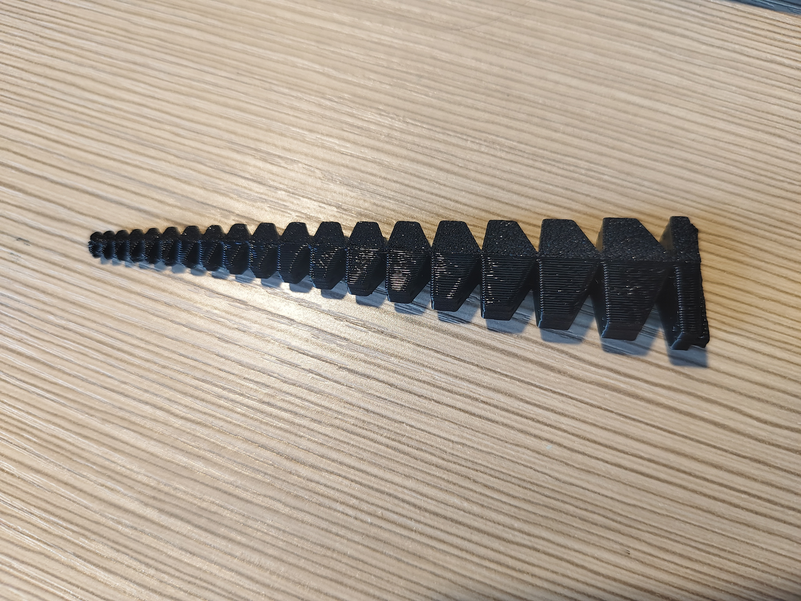
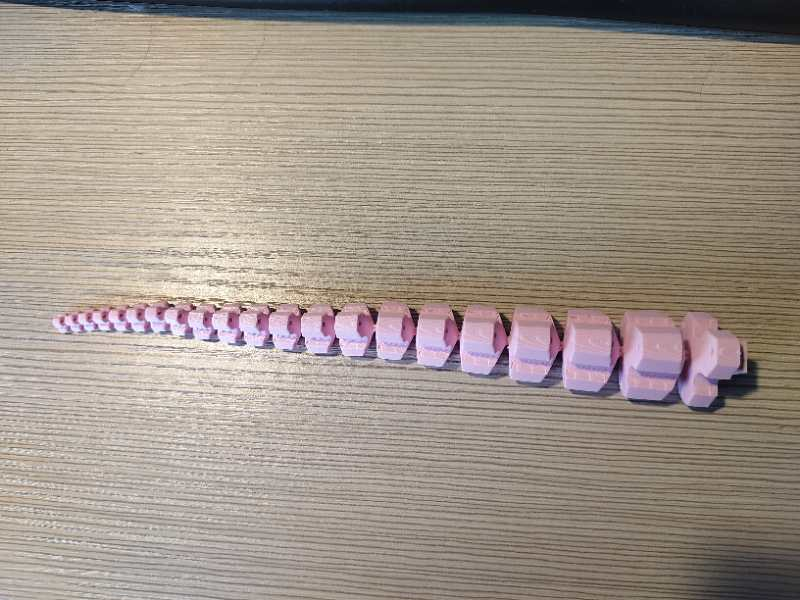
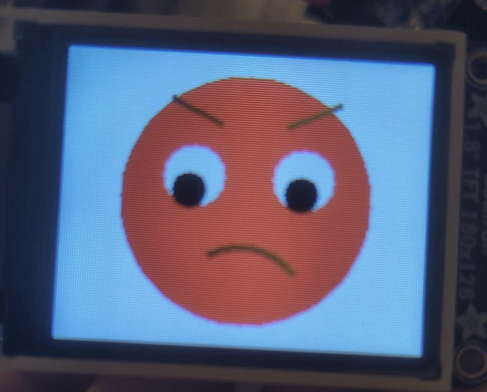
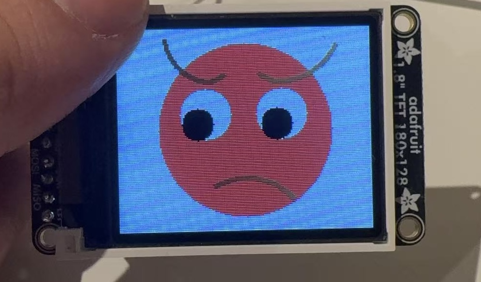
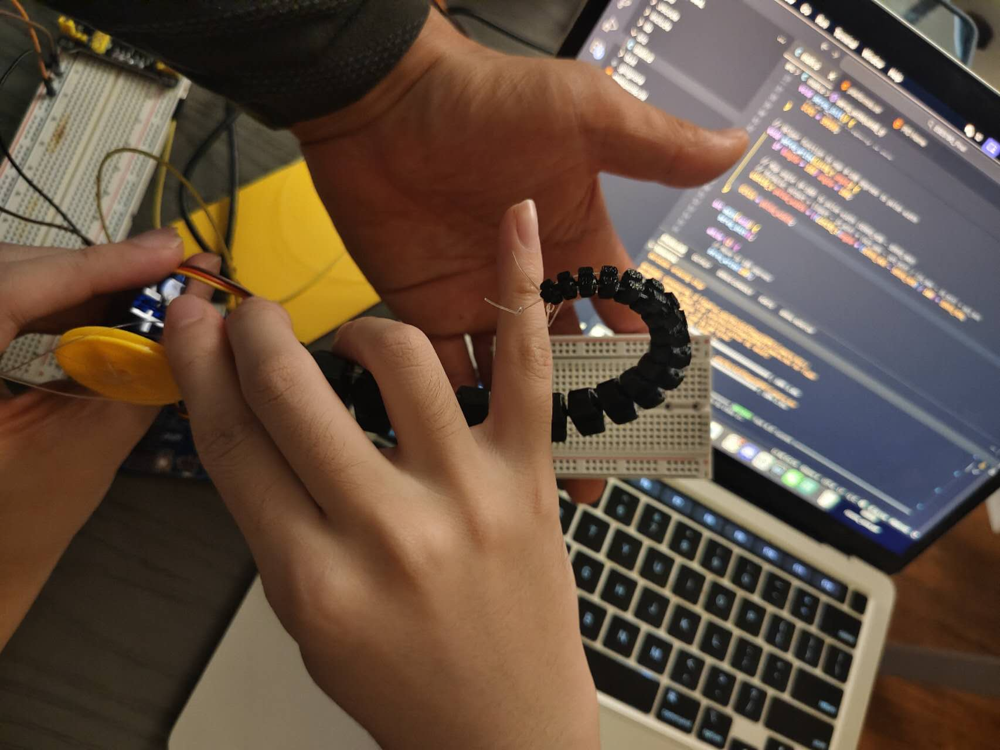

# final-project-skeleton

**Team Number: 6**

**Team Name: Momo**

| Team Member Name | Email Address           |
| ---------------- | ----------------------- |
| Yunzhe Deng      | deng1@seas.upenn.edu    |
| Jilu Wang        | jlwang25@seas.upenn.edu |
| Rico Zhuang      | zzhuan13@seas.upenn.edu |

**GitHub Repository URL:** [https://github.com/upenn-embedded/final-project-f25-f25_final_project_momo](https://github.com/upenn-embedded/final-project-f25-f25_final_project_momo)

**GitHub Pages Website URL:** [https://github.com/orgs/upenn-embedded/teams/f25_final_project_momo](https://github.com/orgs/upenn-embedded/teams/f25_final_project_momo)

## Final Project Proposal

### 1. Abstract

*In a few sentences, describe your final project.*

This project aims to design and build a spiral soft robot inspired by the structure and motion of an octopus tentacle. The robot can decorate desktop setup, and also perform simple grasping tasks such as picking up small objects. Different from traditional robot arms, ours uses a flexible spiral structure. It bends, curls, and wraps around items, simulating the smooth and adaptive movements found in nature.

### 2. Motivation

*What is the problem that you are trying to solve? Why is this project interesting? What is the intended purpose?*

The problem we what to solve is that the traditional robots are rigid and not suitable for delicate interactions, such as safely engaging with children. Our project seeks to solve this problem by creating a soft, tentacle-like robot that is both educational and interactive. The project is interesting because it serves as a fun and approachable introduction to robotics for young learners. Our intended purpose is to let our project acts as both a desk ornament and a friendly companion that demonstrates the beauty of natural motion of robots to those young learners and others.

### 3. System Block Diagram

*Show your high level design, as done in WS1 and WS2. What are the critical components in your system? How do they communicate (I2C?, interrupts, ADC, etc.)? What power regulation do you need?*

Below is the system block diagram:

For UltraSonic Sensor, we will use UART or just monitor the echo trigger, like what we did in Lab3, to acquire the distance measurement.

For Touch Sensor, we will use interrupts or I2C to monitor if there is touching and feedback in the system.

Meanwhile, we will use SPI to communicate between MCU and Motor Control unit, to implement control of the motor, and consequently, control of the robotic arm.

We will also build up a buck-boost converter to manage the power, which can both step up and step down the input voltage, providing a stable output across a wide range of input levels. It’s efficient, compact, cost-effective, and ideal for battery-powered systems.

### 4. Design Sketches

*What will your project look like? Do you have any critical design features? Will you need any special manufacturing techniques to achieve your vision, like power tools, laser cutting, or 3D printing?  Submit drawings for this section.*

Below is the sketch:

Our design is to build a spiral soft robot that looks like an octopus tentacle. The cross-sectional view of the main body is shown here. The design is inspired by the bionic structure of an octopus arm and follows the logarithmic spiral equation in its construction.

The main functions of our design focus on human–machine interaction, such as tactile sensing and object grasping. In this process, a microcontroller is used to electronically control the motor that drives the robotic arm. It also processes data from sensors and converts it into control signals, which are then output through peripherals such as motors, LCDs, and LEDs.

The main body of the robot — including the tentacle and base — will be 3D printed. The internal control circuit will be built using electronic components and a breadboard, while the final assembly may require laser-cut acrylic plates.

### 5. Software Requirements Specification (SRS)

*Formulate key software requirements here. Think deeply on the design: What must your device do? How will you measure this during validation testing? Create 4 to 8 critical system requirements.*

*These must be testable! See the Final Project Manual Appendix for details. Refer to the table below; replace these examples with your own.*

Requirement 1: The system should verify sampling rate through serial timestamps.

Requirement 2: The system should receive correct LCD text and update it in each interval.

Requirement 3: The systems should observe motor response on oscilliscope PWM duty cycle.

Requirement 4: The system should moniter the power status signal and produces the correct power mode by the power management module.

**5.1 Definitions, Abbreviations**

Here, you will define any special terms, acronyms, or abbreviations you plan to use for hardware.

MCU: It's the microcontroller unit, which we will use the ATmega328PB microcontroller.

PWM: It's the Pulse Width Modulation, it generates software-generated signal to control motor angles.

ISR: Interrupt Service Routine, it takes control of real-time sensor data.

ICD Driver: It's the software module that controls text output to the LCD screen.

Motor Controller: It's the software module that computes PWM duty cycles for coordinated motion.

Touch Handler: It's the software module which interprets touch sensor input events.

Ultrasonic Handler: It's the software module which performs distance measurement and filtering.

Power Monitor: It's the Software logic that monitors voltage level reported by the power module.

**5.2 Functionality**

| ID     | Description                                                                                                                                                               |
| ------ | ------------------------------------------------------------------------------------------------------------------------------------------------------------------------- |
| SRS-01 | The MCU firmware shall read the Ultrasonic Sensor distance every 200 ms based on timer interrupts and store the latest value in memory.                            |
| SRS-02 | The software shall process the distance reading and transfers it into a target motor bending angle. We will use a linear control algorithm.                          |
| SRS-03 | The motor control module shall output PWM signals to Motor1 and Motor2 to achieve smooth spiral motion with synchronized speed. The difference should be under 5%.   |
| SRS-04 | When the Touch Sensor is triggered, the system shall toggle between “Idle Mode” and “Active Mode,” enabling or stopping motion.                                 |
| SRS-05 | The LCD Display Module shall update every 0.5 seconds to show system mode. The mode is (“Idle,” “Approaching,” “Grasping,” “Low Power”).                    |
| SRS-06 | The LED Indicator Module shall change color according to system state. The preset state is green = idle, yellow = active, red = low power, and we may change later. |
| SRS-07 | The power monitor module shall continuously check voltage level and send a shutdown signal if voltage is lower than the threshold, preventing motor damage.          |
| SRS-08 | The software shall store and transmit debugging information like distance, PWM value and mode information via UART for performance validation.                       |

### 6. Hardware Requirements Specification (HRS)

*Formulate key hardware requirements here. Think deeply on the design: What must your device do? How will you measure this during validation testing? Create 4 to 8 critical system requirements.*

*These must be testable! See the Final Project Manual Appendix for details. Refer to the table below; replace these examples with your own.*

Requirement 1: It should verify detection range by comparing measured distance and actual distance.

Requirement 2: It needs to observe serial output and confirm the reponse time after human interaction.

Requirement 3: The Servo Motor shall provide sufficient torque to bend or lift a section of the spiral arm.

Requirement 4: The LED indicator shall reflect the robot’s current operating state. It should turn green when the system is idle, yellow when active or moving, and red when an error or low power condition occurs.

**6.1 Definitions, Abbreviations**

Here, you will define any special terms, acronyms, or abbreviations you plan to use for hardware

MCU: It's ATmega328PB microcontroller, but it serves as a hardware part for the system’s central control unit.

Ultrasonic Sensor: It's a sensor (HC-SR04 module) used to measure distance to nearby objects.

Touch Sensor: It's the capacitive touch sensor module for detecting user input. It senses changes in capacitance when a human finger touches or comes close

Servo Motor: It's the small DC motor for controlling the rotation for the robots to bend the spiral arm.

LED: It's the indicator light for status feedback, and it will show different color which indicates different status.

LCD: It displays module showing real-time sensor data and system state, such as the smile emotion or angry emotion.

Power Management: It's the circuit module that distributes regulated power to all components.

**6.2 Functionality**

| ID     | Description                                                                                                                                                                                  |
| ------ | -------------------------------------------------------------------------------------------------------------------------------------------------------------------------------------------- |
| HRS-01 | The ultrasonic sensor shall detect distances ranging from 2 cm to 120 cm.                                                                                                                   |
| HRS-02 | The touch sensor shall reliably detect a human finger touch within 100 ms latency and provide a digital signal of the detected input to the MCU.                                      |
| HRS-03 | Each motor shall provide at least 1kg·cm torque and rotate through a minimum of  180° , this allows the spiral structure to bend smoothly.                                          |
| HRS-04 | The LED indicator shall operate between 3.3 V and 5 V and draw less than 20 mA of current for safe operation.                                                                            |
| HRS-05 | The LCD display shall operate at 5 V and display 2x16 characters witbh sufficient brightness.                                                                                               |
| HRS-06 | The power management module shall be able to regulate voltage and produce a stable output between 4.5 V and 5.5 V to supply the MCU, sensors, and motors under varying load conditions. |
| HRS-07 | The ATmega328PB MCU shall run at a 16 MHz clock frequency and provide appropriate analog sensor readings.                                                                                   |

### 7. Bill of Materials (BOM)

*What major components do you need and why? Try to be as specific as possible. Your Hardware & Software Requirements Specifications should inform your component choices.*

We need ATmega328PB as our main controller, a DAC, a motor driver by waveshare to control our two motors, a 2,8'' LCD for emotion display, a US-100 ultrasonic sensor to implement our feature of nearby sensing, and two servos as our main acuator to control the tentacle. We use the ATmega328PB Xplained Mini as the main processor because it provides sufficient GPIO, I2C, SPI, and UART interfaces to manage multiple sensors and actuators simultaneously. An 8-channel 12-bit I2C DAC (Adafruit 6223) is included to convert digital signals to precise analog outputs, enabling smooth control of actuators such as motors. The Motor Driver (Waveshare 25514) interfaces via GPIO pins to control the speed and direction of the motors, while the 2.8" TFT LCD (Adafruit 1770) connected through SPI displays system data and feedback to the user. The US-100 ultrasonic sensor uses UART to measure distance, providing critical input data for real-time control. Finally, two DFRobot servos controlled through GPIO outputs allow the device to physically interact with its environment. Together, these components form an integrated electromechanical system that fulfills all sensing, processing, and actuation requirements of our design.

Here is the link: [BOM Link](https://docs.google.com/spreadsheets/d/1XkmBdJc7wZfoU8gqMUo7F61g3photx3qDpM5JjB5MiU/edit?usp=sharing)

*In addition to this written response, copy the Final Project BOM Google Sheet and fill it out with your critical components (think: processors, sensors, actuators). Include the link to your BOM in this section.*

### 8. Final Demo Goals

*How will you demonstrate your device on demo day? Will it be strapped to a person, mounted on a bicycle, require outdoor space? Think of any physical, temporal, and other constraints that could affect your planning.*

Since it’s a compact, self-contained device, we’ll bring it to Demo Day for guests to interact with directly. Visitors will be able to observe how the tentacle moves, senses touch, and reacts to nearby objects in real time. They’ll also experience its subtle color and motion changes that mimic natural behavior, making the robot feel alive. This hands-on demonstration will showcase the project’s blend of engineering precision and playful, lifelike design.

### 9. Sprint Planning

*You've got limited time to get this project done! How will you plan your sprint milestones? How will you distribute the work within your team? Review the schedule in the final project manual for exact dates.*

| Milestone  | Functionality Achieved                                         | Distribution of Work                                                                       |
| ---------- | -------------------------------------------------------------- | ------------------------------------------------------------------------------------------ |
| Sprint #1  | 1. the frame of the robot 2. motor control                | Yunzhe: Hardware component Rico: Motor driver Jilu: 3D modeling                 |
| Sprint #2  | 1. color change 2. distance sensing 3. touch sensing | Yunzhe: color change Rico: distance sensing Jilu: touch sensing                  |
| MVP Demo   | 1. idle animation 2. testing in real world environment    | Yunzhe: idle animation Rico: testing & debug Jilu: record testing output & debug |
| Final Demo | 1. complete all functionality testing                          | Yunzhe: testing & debug Rico: testing & debug Jilu: testing &debug               |

**This is the end of the Project Proposal section. The remaining sections will be filled out based on the milestone schedule.**

## Sprint Review #1

### Last week's progress

**Updates & proof of work for tasks:**

Images, videos:

1. 3-D Printed Interactive Soft Robot Arm
   
   
2. Emoji on LCD screen
   
   

For hardware part, the first time the material we use is PLA. However, the material is too brittle so when we use it to pull items, it will broke. So we change the material to TPU, and now it's a flexible and useable soft robot arm which can lift small items.
For software part, the problem we meet is the animation is reacting too slow due to the frame rate issue. So we have to solve this problem. Otherwise, it will become too lag.

**Anything you observed or discovered throughout the work that is relevant to the project:**
When our soft robotic tentacle is pulling an object, its motion is very smooth. However, when there is no load and we want it to return to its original state, we find that its rebound speed becomes significantly slower. We will try to solve this problem by adjusting the PWM value.

### Current state of project

**What state is the project in right now?**

We have all the components. The hardware part is basically done except for the motor. The software part just started since we need to have more emotions. Each emotion has 10 frame, so that's a lot of workload.

**How the tasks fit into your end goal?**

We feel that this week’s work brings us one step closer to the final goal, and the results so far have been very encouraging. Our current progress aligns closely with what we originally thought, which gives us confidence moving forward.

**Hardware status - have you purchased everything you need(plus backup)? Is everything working right?**

Yes, we have purchased everything need. Everything is working right. However, we still haven't receive the part we ordered.

### Next week's plan

**A brief description of the task:**

**Estimated time:**
The estimated time for next week's plan is 20 hours.

**Assigned team member:**
Zhengyang is responsible for the motor. Yunzhe is responsible for the LCD. Jilu is responsible for the robot arm.

**Definition of “done”:**
We need to create at least three expressions on the LCD to represent anger, happiness, and frustration. Each expression must have 10 frames, and all frames must be unique. We also need to address the LCD stuttering issue. For the motor, we need to resolve the control problems and try to improve the arm’s feedback response after contacting an object. As for the servo, we still need to complete the servo driver.

## Sprint Review #2

### Last week's progress

**Updates & proof of work for tasks:**

**Robot Arm Part**:
During this week, we tested several types of servo motors and found the most suitable one for us.

We tried SG92R, FS90R, and PA169. They have different control logic and different structures; one of them can rotate continuously.

We chose SG92R in the end to move forward with our project, and it needs different duty cycles of the generated PWM to control the angle of the motor.
This is the code of single motor control:
[Single motor control](https://github.com/upenn-embedded/final-project-f25-f25_final_project_momo/blob/main/code/single_motor_control.c)

After this, we tried to control the motors with one control chip, which can free up some timers (so we can use the timers for other functions).

We chose PCA9685 to control all the motors. It uses I2C to communicate with the MCU and generates PWM signals for all motors.

Using this chip, we can use I2C to control the 3 motors we need and make different gestures for the robot arm by setting different angles for the 3 motors.
This is the code for chip control:
[Chip contorl](https://github.com/upenn-embedded/final-project-f25-f25_final_project_momo/blob/main/code/PCA9685_Control.c)

Next, we tried to connect the flexible robot arm with the motor, and it works well.

This is the video of the moving:
[Video](https://drive.google.com/file/d/18rK2kI2uPryY_F_dqEjvm1QTmOkFyIt_/view?usp=drivesdk)

**LCD screen**:
We added several expressions to our code. We also used the ultrasonic sensor to simply control the change of expressions based on different distances.

**Anything you observed or discovered throughout the work that is relevant to the project:**

It takes some time to test and set up the servo motors, because their datasheets are usually too simple.

### Current state of project

**What state is the project in right now?**

The flexible robot arm can rotate and bend as we want now. The LCD can show expressions based on both direct control and the distance readings from the ultrasonic sensor.

We have finished our basic functions. Next, we will focus on improving the performance of our project.

**How the tasks fit into your end goal**

I think we have approximately achieved our goal from last week. Although there is still an issue with the arm’s feedback, it seems that this function cannot be solved at the moment due to hardware limitations.

There was something wromg with the orders we made, so we have to order the parts by ourselves Thursday, and hope we can get the parts next week.

**Hardware status - have you purchased everything you need (plus backups)? Is everything working right?**
Yes, we have bought some new motors to fit the extra functions. But they are still on the way.

### Next week's plan

**A brief description of the task**
We need to:

- Accomplish Robot Arm's feed back control.
- Let the LCD screen oprate smoothly.
- Try to add a new function - control the Robot Arm with Joystick.
- Design the basement and protection of the project, 3D print them.

**Estimated time**

More than 20 hours.

**Assigned team member**

Task1 for Rico and Jilu.
Task2 for Yunzhe .
Task3 for both.
Task4 for Jilu.

**Definition of “done” and Detailed description**

- The feed back control needs the motor to test the force come back from the string, that's why we need a new motor. And this function can help us make the Human–Machine Interaction. We want to make the Robot Arm bend over when we touch it.
- Optimize the LCD program so that it uses less memory and runs more efficiently.
- Let the Robot Arm move and bend over while we pushing or pulling the Joystick - 4 to 8 directions and different speed.
- A solid protection for all the circuits.

## MVP Demo

1. Show a system block diagram & explain the hardware implementation.

   

   There are 2 main hardware parts of our design:

   First is the circuit part as the diagram shows above. So far, we connected the PCA9685 PWM Control chip, LCD Screen and JoyStick directly to the MCU. MCU will supply power to the components and communicate with the components using SPI, I2C and ADC read seperately. The PCA9685 generates 3PWMs, same frequency with different duty cycles to control the angles of the three SG92R servo motors. The motors need extra power from power management.

   The second hardware part is the basement of tentacle. We made 3D model and 3D-printed them to build and fit the motors's packaging. Moreover, it also restrains the fishing wire, which is used to control the tentacle in three different direction.

   
   
2. Explain your firmware implementation, including application logic and critical drivers you've written.

   For tentacle control, we created three libraries of control.

   The first layer directly communicates to the servo control board through I2C to set an angle for a specific servo by different duty cycles.

   The second layer transforms three angles of servos to polar coordinates through a sine wave function, which means the three angles difference with respect to phase. The sum of those phase is 2 pai. In this layer, we can use two parameters, direction angle and bending amplitude, to control the tentacle.

   The third layer is the functions of control. It uses different ways to fix the direction angle and bending amplitude to implement different movements, such as rotating and attacking. Moreover, we also transform the two ADC values from Cartesian coordinates to polar coordinates to fit the two parameters, so we can control the tentacle by JoyStick.

   For LCD part, we create a library which has four functions. These four functions correspond to the four emotions, which represents to four states of the tentacle when we interact with it. We have a signal for each emotion to ensure the initial frame (static) of each emotion is presented only once. This will prevent the problem of refreshing the initial frame forever. In the main function, when an emotion is presented, we set the state of other emotions to 0. After the emotion is presented once, we set the state of that emotion to 1.

   LCD emotions:
   
3. Demo your device.

   We demo it with Praise.
   [Link](https://drive.google.com/file/d/1TTorX1Y_rqzMgEUb_6J0qyoc1DSMSESv/view?usp=drivesdk) to the video.
4. Have you achieved some or all of your Software Requirements Specification (SRS)?

   1. Show how you collected data and the outcomes.

   Requirement 1: The system should verify sampling rate through serial timestamps.
   Yes, we meet the requirement. The system has a debug mode that checks for correct ADC sampling rate and I2C correctness to ensure that the servo driver can correctly function.

   Requirement 2: The system should receive correct LCD text and update it in each interval.
   Yes, we meet the requirement. There is a state machine that verifies which emotion the LCD is displaying.

   Requirement 3: The systems should observe motor response on oscilloscope PWM duty cycle.
   Yes, we meet the requirement. Our I2C can output PWM duty cycle rate to control the motors.

   Requirement 4: The system should monitor the power status signal and produces the correct power mode by the power management module
   Yes, we meet the requirement. Our 9V battery supplies the power management. The power management supports the motors. The 5V voltage output on ATmega board supports the joystick and the PCA9685 PWM Control.
5. Have you achieved some or all of your Hardware Requirements Specification (HRS)?

   1. Show how you collected data and the outcomes.

   Requirement 1: It should verify detection range by comparing measured distance and actual distance.
   No, we don't meet the requirement. Our motors hasn't arrived. If the motors arrive, it can detect the current. So we can demonstrate different emotions based on the strength we interact with the tentacle.

   Requirement 2: It needs to observe serial output and confirm the response time after human interaction.
   No, we don't meet the requirement. Same reason as the previous part, which is we need to wait for our special motor.

   Requirement 3: The Servo Motor shall provide sufficient torque to bend or lift a section of the spiral arm.
   Yes, we meet the requirement. Our current torque is power enough to allow the tentacle to bend in different directions and different angles. Moreover, we can allow the tentacle to tangle with our finger.

   Requirement 4: The LED indicator shall reflect the robot’s current operating state. It should turn green when the system is idle, yellow when active or moving, and red when an error or low power condition occurs.
   No, we don't meet the requirement. We find LED light is too heavy for the tentacle, so we may cancel this hardware requirement. If we have more time when we finish all the parts, we may consider implement this requirement.
6. Show off the remaining elements that will make your project whole: mechanical casework, supporting graphical user interface (GUI), web portal, etc.

   We still need to print a covering case for the tentacle, so that only the tentacle part is exposed and the wiring, servos, battery, and the servo driver will be hidden. The case will leave openings for LCD and ultrasonic sensor. We also need to setup ESP-Feather for a wireless control through joystick.
7. What is the riskiest part remaining of your project?
   The riskiest part is that we still don't have our analog feedback servos, and so if those require more resources that we had imagined, we might not be able to implement that feature in time. We also don't know if the code's structure needs to be fundamentally change to accommodate for the new servos.

   1. How do you plan to de-risk this?
      We can de-risk this by putting our code into modules based on functionality, and putting them together in the main file. This way when our new servos arrive we can simply add new modules, and we can conduct unit tests much easier.
8. What questions or help do you need from the teaching team?
   We need advice on power management. More specifically, we want to know how to make 3 separate, stable 5V lines with our existing power management system.

## Final Project Report

Don't forget to make the GitHub pages public website!
If you’ve never made a GitHub pages website before, you can follow this webpage (though, substitute your final project repository for the GitHub username one in the quickstart guide):  [https://docs.github.com/en/pages/quickstart](https://docs.github.com/en/pages/quickstart)

### 1. Video

 [Final Video](https://drive.google.com/file/d/1Qw_lwsKCQLMO9i5y78lkQEAi8CrZNoC1/view?usp=drivesdk)

* The video must demonstrate your key functionality.
* The video must be 5 minutes or less.
* Ensure your video link is accessible to the teaching team. Unlisted YouTube videos or Google Drive uploads with SEAS account access work well.
* Points will be removed if the audio quality is poor - say, if you filmed your video in a noisy electrical engineering lab.

### 2. Images

[Insert final project images here]

*Include photos of your device from a few angles. If you have a casework, show both the exterior and interior (where the good EE bits are!).*

### 3. Results

*What were your results? Namely, what was the final solution/design to your problem?*

#### 3.1 Software Requirements Specification (SRS) Results

*Based on your quantified system performance, comment on how you achieved or fell short of your expected requirements.*

*Did your requirements change? If so, why? Failing to meet a requirement is acceptable; understanding the reason why is critical!*

*Validate at least two requirements, showing how you tested and your proof of work (videos, images, logic analyzer/oscilloscope captures, etc.).*

| ID     | Description                                                                                               | Validation Outcome                                                                          |
| ------ | --------------------------------------------------------------------------------------------------------- | ------------------------------------------------------------------------------------------- |
| SRS-01 | The IMU 3-axis acceleration will be measured with 16-bit depth every 100 milliseconds +/-10 milliseconds. | Confirmed, logged output from the MCU is saved to "validation" folder in GitHub repository. |

#### 3.2 Hardware Requirements Specification (HRS) Results

*Based on your quantified system performance, comment on how you achieved or fell short of your expected requirements.*

*Did your requirements change? If so, why? Failing to meet a requirement is acceptable; understanding the reason why is critical!*

*Validate at least two requirements, showing how you tested and your proof of work (videos, images, logic analyzer/oscilloscope captures, etc.).*

| ID     | Description                                                                                                                        | Validation Outcome                                                                                                      |
| ------ | ---------------------------------------------------------------------------------------------------------------------------------- | ----------------------------------------------------------------------------------------------------------------------- |
| HRS-01 | A distance sensor shall be used for obstacle detection. The sensor shall detect obstacles at a maximum distance of at least 10 cm. | Confirmed, sensed obstacles up to 15cm. Video in "validation" folder, shows tape measure and logged output to terminal. |
|        |                                                                                                                                    |                                                                                                                         |

### 4. Conclusion

Reflect on your project. Some questions to address:

* What did you learn from it?
  From this project, we learn how to design a multi-layer control architecture where we combine both hardware part and software part into an interacting sysem. We applied the concepts from lectures, worksheets, and labs to build something that actually works in a real embedded system. We gained experience from I2C motors which can perform tasks in different angles and strength. We also learned how to convert joystick ADC reading into polar coordinates so we can smoothly control the robot's behavior. For the LCD side, we learned how to design different emotions based on different shapes such as arc, circle, and lines. We also learned how to upgrade the freshing rate and how to write functions that don't block the system. By assigning each emotion a dedicated state flag, we ensured that each initial frame is drawn only once, which significantly improved performance and responsiveness. Integrating the LCD part with the overall embeed system provides a visual feedback for the users. Overall, we learned how to structure embedded code in an overall system, manage real-time interactions across multiple peripherals, and design user-friendly control abstractions on top of low-level hardware.

* What went well?
  Our tentacle responds very smoothly and can reach almost any angle we want. We also added remote joystick control so other people can easily try it out. The LCD face now changes smoothly with different speeds, and the tentacle performs different motions in different situations, making it feel interactive and responsive to the user.

* What accomplishments are you proud of?
  We are very confident in how our tentacle interacts with users, because our LCD expressions are vivid and fully animated, with four distinct emotional faces. The default face is a winking expression that loops when nothing is happening or when no movement is detected. When a user approaches very quickly, the tentacle shows an angry face and pretends to “attack” them. When the user approaches at a normal speed, it switches to a big laughing, happy face. When the user moves away, it shows a crying face, and the tentacle waves twice as if saying “goodbye". In addition, we think using three fishing lines to control the tentacle is a very clever design. With this setup, we can precisely control the tentacle and move it to almost any angle we want.

* What did you learn/gain from this experience?
  We learned a lot from this project. We realized that the concepts from worksheets, labs, and lectures all came together and were actually used in a real system. Even more importantly, we learned how to work together as a team to finish a complex project. Since everyone had different free time, good communication and clear task distribution were extremely important for keeping the project on track.

* Did you have to change your approach?
  Yes, we changed our original idea of using current feedback from touching the tentacle to trigger reactions. Originally, our plan was to read the ADC values of the current coming back from the tentacle and use that to control both the tentacle’s motion and the LCD expressions, instead of using the ultrasonic sensor to detect speed and distance like we do now.
  However, the motor we ordered never arrived, and the motors available in the lab don’t provide ADC feedback. Because of this hardware limitation, we were not able to achieve our original interaction design.

* What could have been done differently?
  Right now, we use separate interrupts: one for controlling the tentacle and one for updating the LCD. In theory, we could merge them into a single interrupt, but that would require us to restructure a large part of the codebase. We can also improve the LCD delay issue. The LCD itself is quite slow to update, and when we are using both the tentacle and the LCD at the same time, we were worried about causing more interrupt conflicts. Because of that, we avoided adding another interrupt and instead used delay in some places, which makes the system feel less responsive. If we refactor the code to unify the interrupts and remove those blocking delays, the overall behavior of our system would become much smoother and more responsive.

* Did you encounter obstacles that you didn’t anticipate?
  We ran into several problems during development. One big issue was that both the tentacle control and the LCD used interrupts, and the two interrupt routines sometimes interfered with each other. At the beginning, this often caused the whole program to freeze. We also had a power distribution problem: at first, the LCD board only worked properly when it had its own separate 5 V supply. Later, we rewired it so it could share the VCC line with the rest of the system, and that fixed the issue.
  Another problem was that our deadzone for the joystick wasn’t being triggered at all. We originally set the threshold to 30, but after we added the “virtual joystick” function, the values shifted to around 38, so the deadzone condition was never met. We were stuck and debugged this for a long time. In the end, we raised the threshold, and the deadzone started working correctly.
* What could be a next step for this project?
  As I mentioned before, we didn’t implement current feedback this time. In the future, we want to use motors that provide ADC readings, so we can detect current changes and use them to trigger different expressions and motions. We also want to improve the enclosure. Right now, the motor and tentacle are held in place with tape, which doesn’t look good and isn’t very stable. A better design would mount the motor and tentacle to the shell using screws. In addition, the back panel is currently open, so you can see all the wires from outside. We could add a hinged back door to hide the electronics and make the whole system look cleaner and more good-looking.

## References

Fill in your references here as you work on your final project. Describe any libraries used here.
