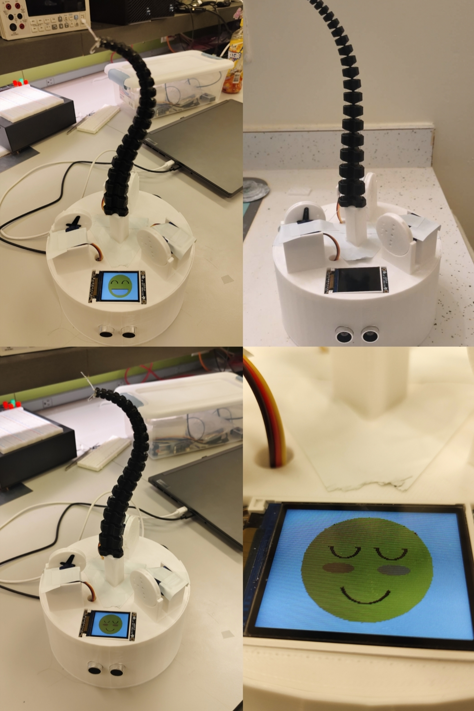
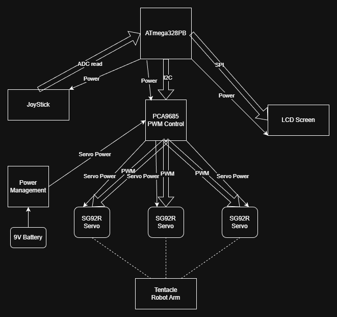
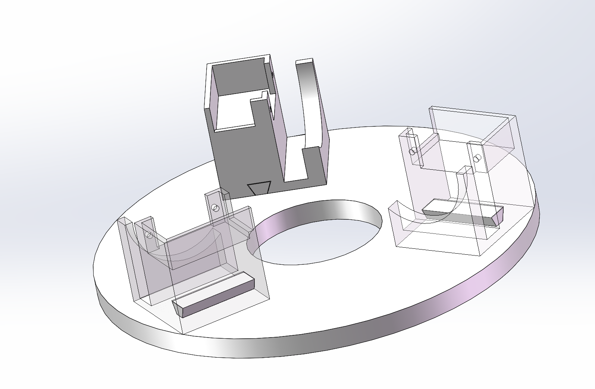
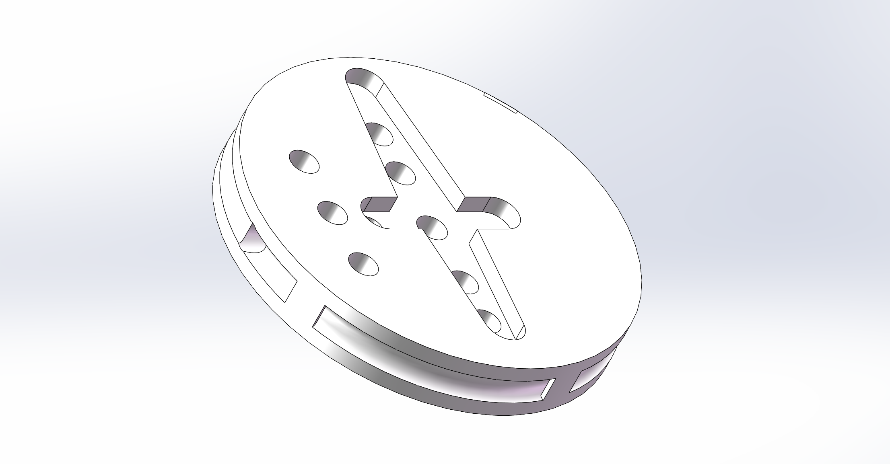
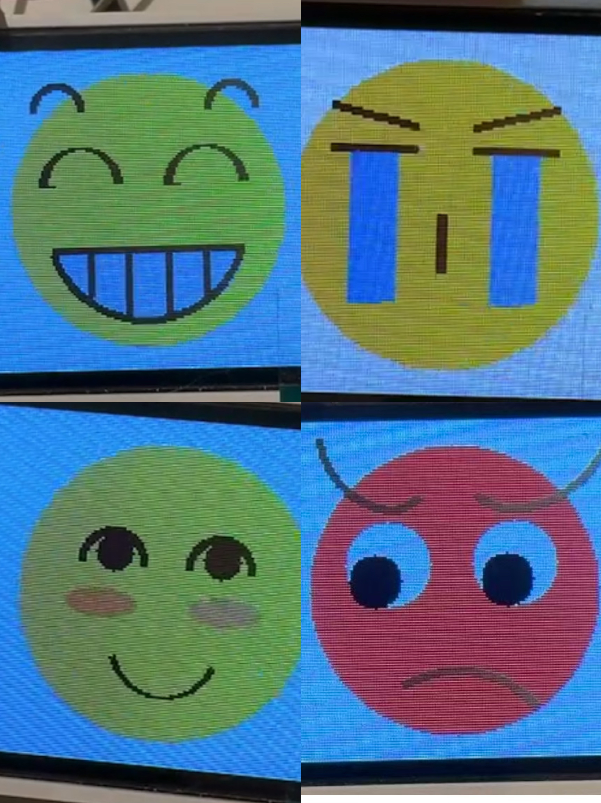

### Links

- [GitHub Repository:](https://github.com/upenn-embedded/final-project-website-submission-f25-t06-f25-momo-1.git) https://github.com/upenn-embedded/final-project-website-submission-f25-t06-f25-momo-1.git
- [GitHub Pages Website:](https://upenn-embedded.github.io/final-project-website-submission-f25-t06-f25-momo-1/) https://upenn-embedded.github.io/final-project-website-submission-f25-t06-f25-momo-1/

## Final Project Report

### 1. Video

<iframe src= “https://drive.google.com/file/d/13_xYOcfeGA3VXRt4HAyZus1sqLD7OBYS/view?usp=drivesdk”
        width="800" height="450" allow="autoplay"></iframe>

If the video does not load, click here:
https://drive.google.com/file/d/13_xYOcfeGA3VXRt4HAyZus1sqLD7OBYS/view?usp=drivesdk

### 2. Images

### 3. Results

Our final product is an interactive desktop toy. Its main body—including the flexible robotic arm, motor housing, and base—is fabricated using 3D printing technology. The electronic components include MCUs, an LCD screen, three servo motors, an ultrasonic sensor, and a battery.

Its primary functions include sensing the movement speed of a user’s hand or nearby objects and responding with corresponding facial expressions and robotic arm movements. Additionally, the robotic arm can be remotely controlled to perform simple tasks, such as grasping objects.

#### 3.1 Software Requirements Specification (SRS) Results

| ID     | Description                                                                                                                         | Validation Outcome                                                                                                                                                                                                             |
| ------ | ----------------------------------------------------------------------------------------------------------------------------------- | ------------------------------------------------------------------------------------------------------------------------------------------------------------------------------------------------------------------------------ |
| SRS-01 | **Polar Control Mapping:** Using two polar-coordinate parameters to control the angles of three servos.                       | Confirmed. Finally we use sinwave functions to translate the parameters, which can control the movement of the robot arm by the pointing angle and bending factor we want.                                                     |
| SRS-02 | **Preset Motion Functions:** Implemented several predefined robotic-arm movements through dedicated code functions.           | Confirmed. We programmed 4 funnctions to control the fixed movement of robot arm, and they will be called after the different emotion modes.                                                                                   |
| SRS-03 | **Remote Arm Control:** Enabled remote control of the robotic arm and scaled analog signals appropriately for different MCUs. | Confirmed. We use ESP32 to recievd wireless signal from Blynk, and transfer the analog signal to Atmega328PB, which is our main MCU. In this chip, we scaled the signal and convert it to the two polar-coordinate parameters. |
| SRS-04 | **LCD Facial Expressions:** Displayed four different facial expressions on the LCD with smooth and stable refreshing.         | Confirmed. We made four different facial expressions om LCD: Joy, Smile, Angry and Cry. They will show up in different emotin modes based on the catched speed.                                                                |
| SRS-05 | **Accurate Speed Sensing:** Ultrasonic sensor correctly detected and calculated object movement speed.                        | Confirmed. This function can detect four kinds of spped: Stay, slow approaching, fast approaching and leaving. These will leads to four modes, which will show difference on facial expressions and robot arm movemnets.       |
| SRS-06 | **Stable System Integration:** All functions operated smoothly without interfering with each other.                           | Confirmed. We use interrupt to arrange the different parts, and the final product can work smoothly.                                                                                                                           |

#### 3.2 Hardware Requirements Specification (HRS) Results

| ID     | Description                                                                                                                                             | Validation Outcome                                                                                                                                                                          |
| ------ | ------------------------------------------------------------------------------------------------------------------------------------------------------- | ------------------------------------------------------------------------------------------------------------------------------------------------------------------------------------------- |
| HRS-01 | **Mechanical Structure Design:** Designed and optimized the entire mechanical system, including the arm, motor housing, and circuit-storage base. | Confirmed. We designed and printed the whole mechanical parts in this project. During the process, we keeped updating them to fit the best performence.                                     |
| HRS-02 | **Power Management Isolation:** Ensure independent and stable power delivery.                                                                     | Confirmed. We use a extra power managment chip and a battery to make sure the power can be sent to each part stable, especially isolating high-current servo motors from other electronics. |
| HRS-03 | **Hardware Layout Optimization:** Refined overall hardware placement to safely and neatly organize all circuitry.                                 | Confirmed. We hide our circuit in a printed basement to protect them.                                                                                                                       |

### 4. Conclusion

In this project, we learned how to design a multi-layer control architecture that integrates hardware and software into a cohesive interactive system. Concepts from lectures, worksheets, and labs were applied directly to a real embedded implementation. We gained experience using I2C motors to execute movements with varying angles and strength, and we learned to convert joystick ADC readings into polar coordinates for smooth robotic control. On the LCD side, we learned to create expressive faces using arcs, circles, and lines, and we optimized refresh behavior by reducing blocking operations. By using state flags to avoid redrawing initial frames, we significantly improved the responsiveness of the display. Integrating the LCD with the rest of the embedded system provided users with clear and immediate visual feedback.

Overall system performance exceeded expectations. The tentacle moved smoothly and was capable of reaching almost any desired angle, and remote joystick control made the system more accessible and interactive. The LCD faces transitioned smoothly based on detected speed, and the tentacle performed different animations in different scenarios, resulting in lifelike and engaging user interaction. We are particularly proud of the expressiveness of the system: the LCD features four animated emotional faces—from a default blinking expression, to an angry “attack” face, a joyful laughing face, and a crying “goodbye” face when the user moves away—all synchronized with the tentacle’s physical movements. Our mechanical design using three fishing lines proved to be a clever and effective approach, combining flexibility with precise control.

The project also taught us the importance of teamwork. Since everyone’s schedule differed, clear communication and task division were essential for keeping the project on track. We encountered several technical challenges during development, including interrupt conflicts between the tentacle controller and the LCD that initially caused system freezes, power distribution issues that required rewiring the LCD to share the main VCC, and a joystick deadzone that malfunctioned due to shifted ADC values. Through careful debugging and iteration, we resolved these issues and improved system stability.

Looking ahead, we hope to implement current-feedback interaction using motors capable of ADC current sensing, allowing the tentacle to respond to touch or force in more intuitive ways. We also plan to refine the enclosure: replacing tape mounts with screw-based fixtures for greater durability, and adding a hinged back cover to hide wiring and create a cleaner, more polished appearance.

## Appendix: Final Project Proposal

### 1. Abstract

This project aims to design and build a spiral soft robot inspired by the structure and motion of an octopus tentacle. The robot can decorate desktop setup, and also perform simple grasping tasks such as picking up small objects. Different from traditional robot arms, ours uses a flexible spiral structure. It bends, curls, and wraps around items, simulating the smooth and adaptive movements found in nature.

### 2. Motivation

The problem we what to solve is that the traditional robots are rigid and not suitable for delicate interactions, such as safely engaging with children. Our project seeks to solve this problem by creating a soft, tentacle-like robot that is both educational and interactive. The project is interesting because it serves as a fun and approachable introduction to robotics for young learners. Our intended purpose is to let our project acts as both a desk ornament and a friendly companion that demonstrates the beauty of natural motion of robots to those young learners and others.

### 3. System Block Diagram

Below is the system block diagram:

The circuit parts of our design:

So far, we connected the PCA9685 PWM Control chip,LCD Screen and JoyStick directly to the MCU. MCU willsupply power to the components and communicate withthe components using SPI, I2C and ADC readseperately. The PCA9685 generates 3PWMs, samefrequency with different duty cycles to control theangles of the three SG92R servo motors. The motorsneed extra power from power management.

### 4. Design Sketches

Below is the sketch:

Our design is to build a spiral soft robot that looks like an octopus tentacle. The cross-sectional view of the main body is shown here. The design is inspired by the bionic structure of an octopus arm and follows the logarithmic spiral equation in its construction.

The main functions of our design focus on human–machine interaction, such as tactile sensing and object grasping. In this process, a microcontroller is used to electronically control the motor that drives the robotic arm. It also processes data from sensors and converts it into control signals, which are then output through peripherals such as motors, LCDs, and LEDs.

The hardware part is the basement of tentacle.We made 3D model and 3D-printed them to build and fitthe motors's packaging. Moreover, it also restrainsthe fishing wire, which is used to control thetentacle in three different direction.

For tentacle control, we created three libraries of control.

The first layer directly communicates to the servocontrol board through I2C to set an angle for aspecific servo by different duty cycles.

The second layer transforms three angles of servos topolar coordinates through a sine wave function, whichmeans the three angles difference with respect tophase. The sum of those phase is 2 pai. In thislayer, we can use two parameters, direction angle andbending amplitude, to control the tentacle.

The third layer is the functions of control. It usesdifferent ways to fix the direction angle and bendingamplitude to implement different movements, such asrotating and attacking. Moreover, we also transformthe two ADC values from Cartesian coordinates topolar coordinates to fit the two parameters, so wecan control the tentacle by JoyStick.

For LCD part, we create a library which has fourfunctions. These four functions correspond to thefour emotions, which represents to four states of thetentacle when we interact with it. We have a signalfor each emotion to ensure the initial frame (static)of each emotion is presented only once. This willprevent the problem of refreshing the initial frameforever. In the main function, when an emotion ispresented, we set the state of other emotions to 0.After the emotion is presented once, we set the stateof that emotion to 1.
LCD emotions:

### 5. Bill of Materials (BOM)

We need ATmega328PB as our main controller, a DAC, a motor driver by waveshare to control our two motors, a 2,8'' LCD for emotion display, a US-100 ultrasonic sensor to implement our feature of nearby sensing, and two servos as our main acuator to control the tentacle. We use the ATmega328PB Xplained Mini as the main processor because it provides sufficient GPIO, I2C, SPI, and UART interfaces to manage multiple sensors and actuators simultaneously. An 8-channel 12-bit I2C DAC (Adafruit 6223) is included to convert digital signals to precise analog outputs, enabling smooth control of actuators such as motors. The Motor Driver (Waveshare 25514) interfaces via GPIO pins to control the speed and direction of the motors, while the 2.8" TFT LCD (Adafruit 1770) connected through SPI displays system data and feedback to the user. The US-100 ultrasonic sensor uses UART to measure distance, providing critical input data for real-time control. Finally, two DFRobot servos controlled through GPIO outputs allow the device to physically interact with its environment. Together, these components form an integrated electromechanical system that fulfills all sensing, processing, and actuation requirements of our design.

Here is the link: [BOM Link](https://docs.google.com/spreadsheets/d/1XkmBdJc7wZfoU8gqMUo7F61g3photx3qDpM5JjB5MiU/edit?usp=sharing)

## References

- ATmega328PB Datasheet
- ESP32 Technical Reference
- [shoggoth-mini](https://github.com/mlecauchois/shoggoth-mini)
- [reference_article](https://www.sciencedirect.com/science/article/pii/S2666998624006033)
